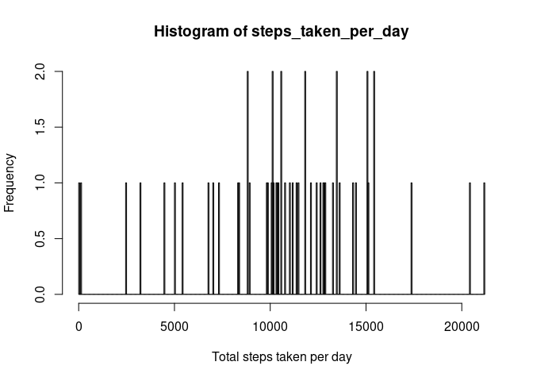
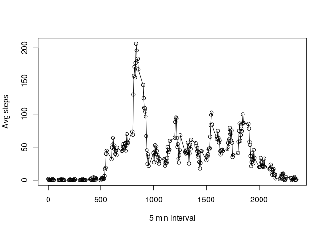
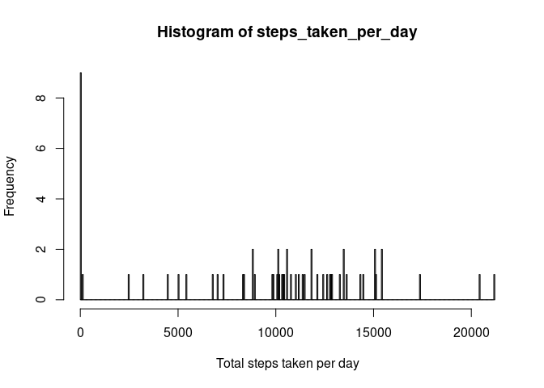
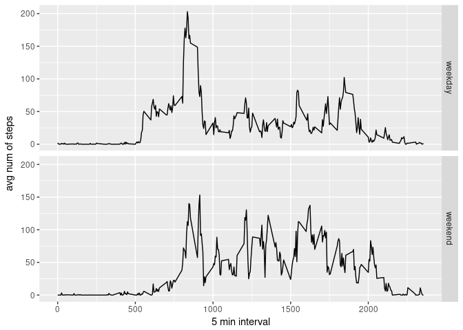

Problem Statement
-----------------

It is now possible to collect a large amount of data about personal
movement using activity monitoring devices such as a Fitbit, Nike
Fuelband, or Jawbone Up. These type of devices are part of the
“quantified self” movement – a group of enthusiasts who take
measurements about themselves regularly to improve their health, to find
patterns in their behavior, or because they are tech geeks. But these
data remain under-utilized both because the raw data are hard to obtain
and there is a lack of statistical methods and software for processing
and interpreting the data.

This assignment makes use of data from a personal activity monitoring
device. This device collects data at 5 minute intervals through out the
day. The data consists of two months of data from an anonymous
individual collected during the months of October and November, 2012 and
include the number of steps taken in 5 minute intervals each day.

The data for this assignment can be downloaded from the course web site:

-   Dataset: [Activity monitoring
    data](https://d396qusza40orc.cloudfront.net/repdata%2Fdata%2Factivity.zip)

The variables included in this dataset are:

steps: Number of steps taking in a 5-minute interval (missing values are
coded as 𝙽𝙰)   date: The date on which the measurement was taken in
YYYY-MM-DD format   interval: Identifier for the 5-minute interval
in which measurement was taken   The dataset is stored in a
comma-separated-value (CSV) file and there are a total of 17,568
observations in this dataset.

Step 1: Loading and preprocessing the data
------------------------------------------

    library(ggplot2)

    fileUrl <- "https://d396qusza40orc.cloudfront.net/repdata%2Fdata%2Factivity.zip"
    download.file(fileUrl, destfile = paste0(getwd(), '/repdata%2Fdata%2Factivity.zip'), method = "curl")
    unzip("repdata%2Fdata%2Factivity.zip",exdir = "data")

Reading the data
----------------

    data <- read.csv("data/activity.csv")

What is the mean total number of steps taken per day ?
------------------------------------------------------

    steps_taken_per_day <- tapply(data$steps,data$date, sum, na.rm=FALSE)
    hist(steps_taken_per_day, xlab='Total steps taken per day',ylab='Frequency', breaks=500)

What are the mean and medial total number of steps:
---------------------------------------------------

    mean_steps <- mean(steps_taken_per_day,na.rm = TRUE)
    media_steps <- median(steps_taken_per_day, na.rm = TRUE)
    mean_steps

    ## [1] 10766.19

    media_steps

    ## [1] 10765

What is the average daily activity pattern?
-------------------------------------------

    avg_steps_per_time <- aggregate(x=list(Avg_Steps=data$steps), by=list(interval=data$interval), FUN=mean, na.rm = TRUE)
    plot(avg_steps_per_time$interval,avg_steps_per_time$Avg_Steps,xlab = "5 min interval", ylab = "Avg steps", type = "o")

Which 5-minute interval, on average across all the days in the dataset, contains the maximum number of steps?
-------------------------------------------------------------------------------------------------------------

    max_steps <- which.max(avg_steps_per_time$Avg_Steps)
    time_of_max_steps <-  gsub("([0-9]{1,2})([0-9]{2})", "\\1:\\2", avg_steps_per_time[max_steps,'interval'])
    time_of_max_steps

    ## [1] "8:35"

\#Imputing Missing Values
-------------------------

1.  Calculate and report the total number of missing values in the
    dataset

<!-- -->

    nMissingVals <- length(which(is.na(data$steps)))
    nMissingVals

    ## [1] 2304

1.  Devise a strategy for filling in all of the missing values in the
    dataset.

2.  Create a new dataset that is equal to the original dataset but with
    the missing data filled in.

<!-- -->

    library(imputeMissings)
    filledData <- impute(data = data)

1.  Make a histogram of the total number of steps taken each day

<!-- -->

    steps_taken_per_day <- tapply(filledData$steps,filledData$date, sum, na.rm=FALSE)
    hist(steps_taken_per_day, xlab='Total steps taken per day',ylab='Frequency', breaks=500)

 …
and Calculate and report the mean and median

    mean_steps <- mean(filledData$steps)
    median_steps <- median(filledData$steps)
    mean_steps

    ## [1] 32.47996

    median_steps

    ## [1] 0

\#Are there differences in activity patterns between weekdays and
weekends? 1. Create a new factor variable in the dataset with two levels
– “weekday” and “weekend” indicating whether a given date is a weekday
or weekend day.

    filledData$dayType <- ifelse(as.POSIXlt(filledData$date)$wday %in% c(0,6),'weekend','weekday')

1.  Make a panel plot containing a time series plot

<!-- -->

    avg_steps_per_time_filled <- aggregate(steps ~ interval + dayType, data=filledData, mean)
    ggplot(avg_steps_per_time_filled, aes(interval,steps))+
        geom_line()+
        facet_grid(dayType ~ .)+
        xlab("5 min interval")+
        ylab("avg num of steps")

